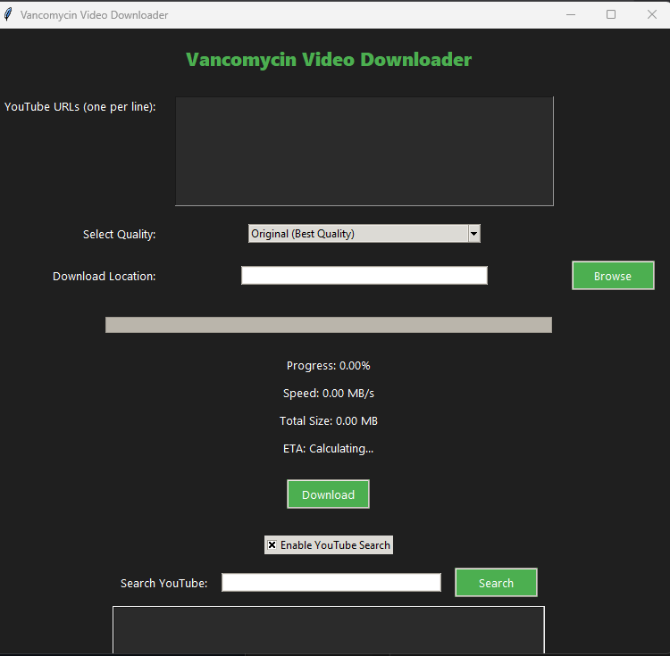

# 🎥 Vancomycin Video Downloader

Vancomycin Video Downloader is a full-featured, user-friendly desktop application built with Python that allows users to download YouTube videos or audio in batch or via search, with various quality options. It supports real-time download tracking.

---

## ✨ Features

- ✅ **Batch Downloading**: Paste multiple YouTube URLs (one per line) to download them simultaneously.
- 🔍 **YouTube Search**: Built-in YouTube search with top-view sorting and double-click insertion into download list.
- 🎚️ **Quality Options**:
  - Original (Best Quality)
  - Lower Quality
  - Lowest Quality
  - Audio Only (MP3)
- 📂 **Custom Download Location**: Choose where files are saved via the Browse button.
- 📊 **Live Progress Display**: Real-time download progress, speed, estimated time, and total file size.
- 🧾 **Download Summary**: Post-download report showing titles, URLs, and statuses.
- 🎨 **Dark Mode GUI**: A clean and modern dark-themed interface styled with ttk and custom themes.

---

## 🚀 How to Use

1. Run the application via Python.
2. Paste YouTube video URLs in the input field (one per line), or enable **YouTube Search** to find videos by keywords.
3. Choose a quality from the dropdown menu.
4. Set the download location.
5. Click **Download**.
6. A summary window will appear once all downloads are complete.
7. Optional: Search for the song/video you want in the search bar down below and results will appear from **YouTube** arranged descendingly according to views.

---

## 🧰 Setup

To get started quickly:

- Just run `requirements.bat` — it will install all necessary dependencies `ffmpeg`, and will auto put it in user variables paths.

---

## 📦 Dependencies

- [`ffmpeg`](https://ffmpeg.org/)

---

## ❤️ Enjoy the Downloading Experience!

Whether you're download a simple video/song or just batch-downloading full playlists, Vancomycin Video Downloader got your back.
---

